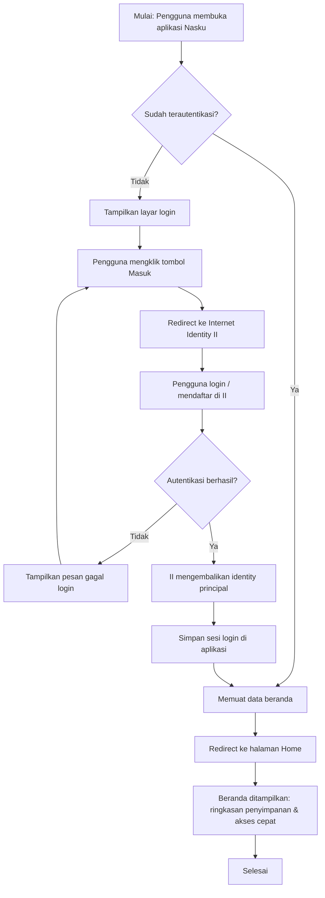
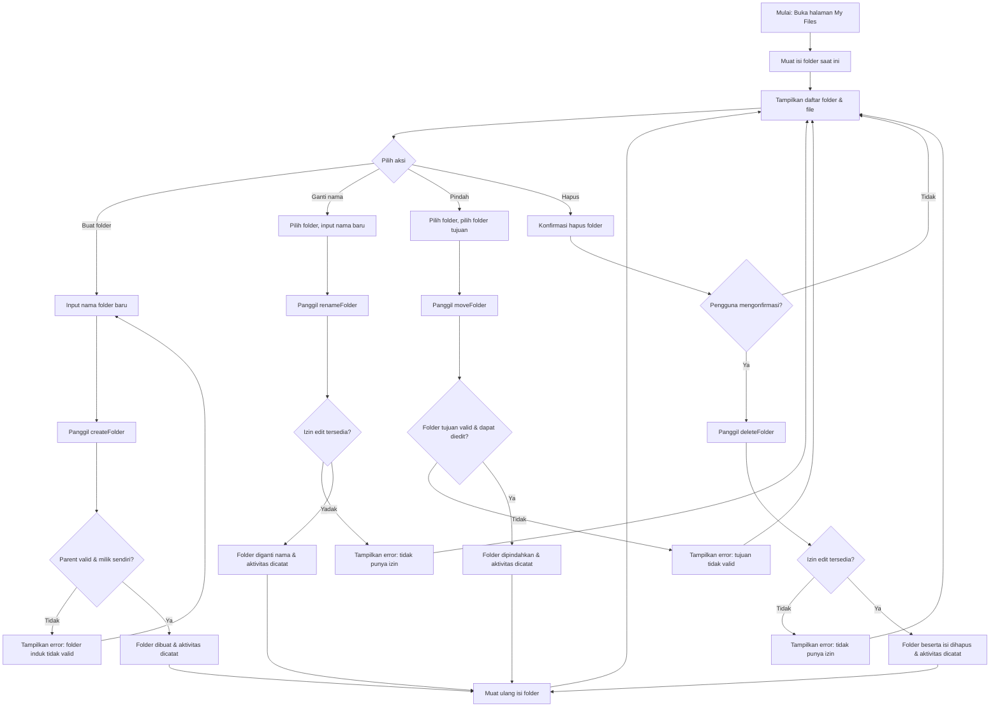
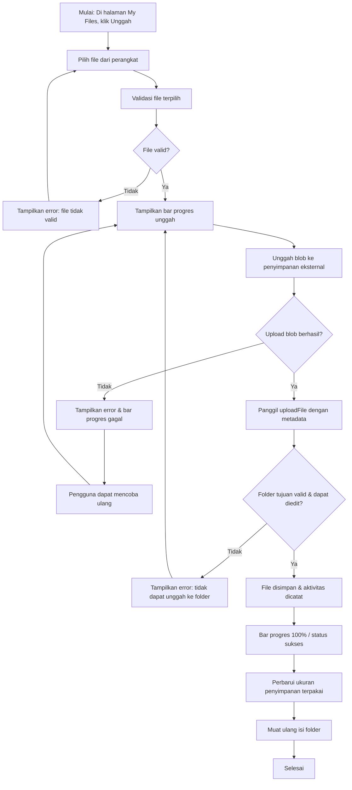
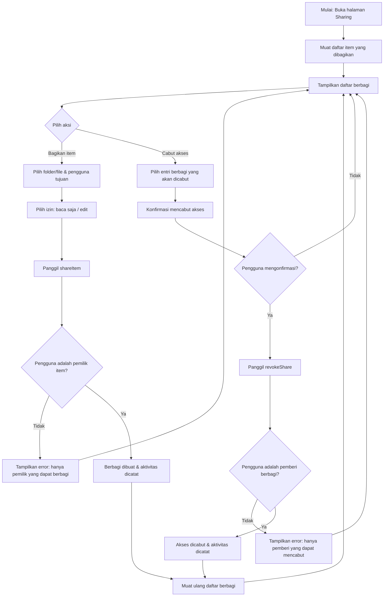
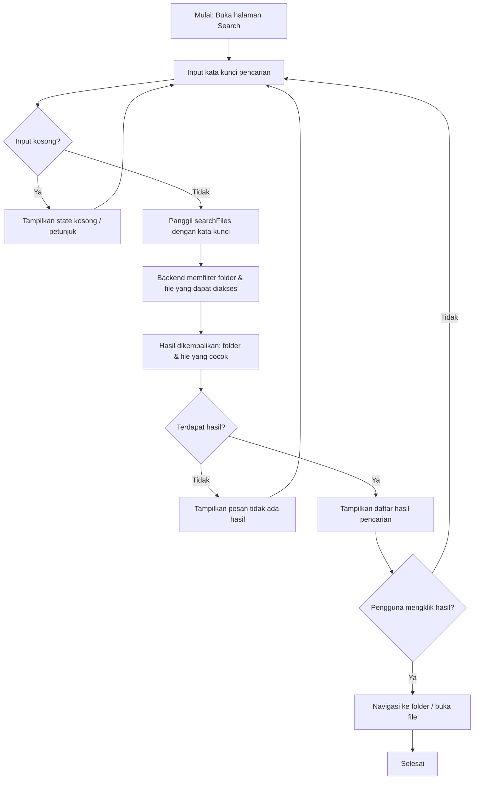
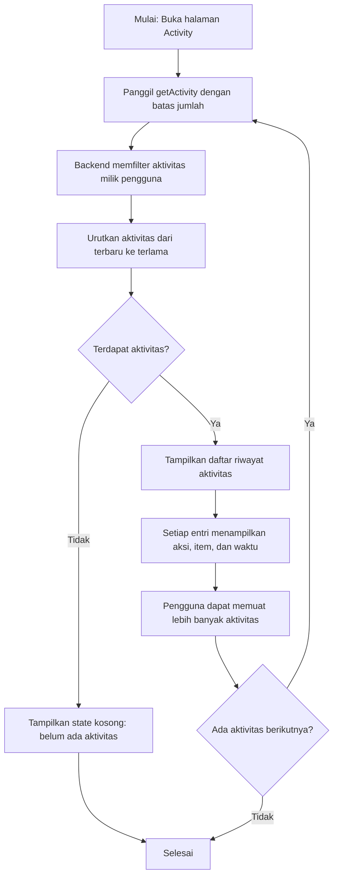

# Dokumentasi Flowchart Aplikasi Nasku

## 1. Ringkasan Aplikasi

**Nasku** adalah aplikasi manajemen file NAS (Network-Attached Storage) berbasis web yang dirancang sebagai *command deck* bergaya dashboard NAS (terinspirasi Synology DSM). Aplikasi ini bersifat **responsif** — tampilan menyesuaikan untuk desktop maupun perangkat mobile (sidebar menciut menjadi *drawer* di mobile, tabel file berubah menjadi kartu).

### Halaman Utama

| Halaman | Rute | Fungsi |
| ------- | ---- | ------ |
| Home | `/` | Beranda, ringkasan penyimpanan dan akses cepat |
| My Files | `/files` | Jelajah folder & file (buat, ganti nama, pindah, hapus) |
| Sharing | `/sharing` | Kelola berbagi item dan mencabut akses |
| Activity | `/activity` | Riwayat aktivitas pengguna |
| Search | `/search?q=` | Pencarian file dan folder |

Seluruh halaman berada di belakang autentikasi **Internet Identity** (II). Pengguna yang belum masuk diarahkan ke layar login.

### Struktur Penyimpanan Backend (Motoko)

Backend dibangun dengan Motoko dan menyimpan data dalam satu state `FilesState` yang berisi empat koleksi utama:

| Koleksi | Tipe | Deskripsi |
| ------- | ---- | --------- |
| `folders` | `Map<FolderId, Folder>` | Folder dengan `id`, `name`, `parentId` (untuk hierarki), `owner`, `createdAt`, `updatedAt` |
| `files` | `Map<FileId, FileEntry>` | File dengan `id`, `name`, `folderId`, `owner`, `blob` (objek penyimpanan eksternal), `size`, `mimeType`, `createdAt`, `updatedAt` |
| `shares` | `Map<ShareId, Share>` | Berbagi item dengan `itemKind` (folder/file), `itemId`, `sharedBy`, `sharedWith`, `permission` (`#readOnly` / `#edit`), `createdAt` |
| `activity` | `List<ActivityEntry>` | Riwayat aktivitas dengan `action` (`#create`, `#rename`, `#move`, `#upload`, `#delete`, `#share`, `#revoke`, `#permissionChange`), `itemKind`, `itemId`, `itemName`, `atNs` |

Setiap operasi tulis (buat, ganti nama, pindah, unggah, hapus, berbagi, cabut) otomatis mencatat entri ke koleksi `activity` milik pemilik item. Kontrol akses memastikan hanya pemilik item atau pengguna yang diberi izin `#edit` yang dapat mengubah item, dan hanya pemilik yang dapat berbagi atau mencabut berbagi.

---

## 2. Flowchart Alur Utama

### 2.1 Alur Login (Internet Identity) hingga Beranda

### 2.2 Alur Jelajah Folder & File di My Files

Alur ini mencakup operasi **buat folder**, **ganti nama**, **pindah**, dan **hapus** pada halaman My Files.

### 2.3 Alur Unggah File dengan Progres & Penyimpanan

### 2.4 Alur Berbagi Item & Mencabut Akses di Sharing

### 2.5 Alur Pencarian File di Search

### 2.6 Alur Riwayat Aktivitas di Activity

---

## 3. Catatan Teknis

- **Autentikasi**: Menggunakan Internet Identity (II). URL penyedia II disuntikkan dari lingkungan deployment dan tidak di-hardcode.
- **Kontrol akses**: Hanya pengguna dengan peran `user` yang dapat melakukan operasi. Pemilik item atau penerima izin `#edit` dapat mengubah item; hanya pemilik yang dapat berbagi/mencabut.
- **Penyimpanan file**: Blob file disimpan di penyimpanan objek eksternal (`Storage.ExternalBlob`), sedangkan metadata (nama, ukuran, tipe, lokasi) disimpan di state backend.
- **Riwayat aktivitas**: Setiap operasi tulis otomatis mencatat entri aktivitas dengan timestamp nanodetik (`atNs`), diurutkan terbaru ke terlama.
- **Responsif**: Sidebar menjadi *drawer* di mobile dan tabel file berubah menjadi kartu agar tetap produktif di layar kecil.
